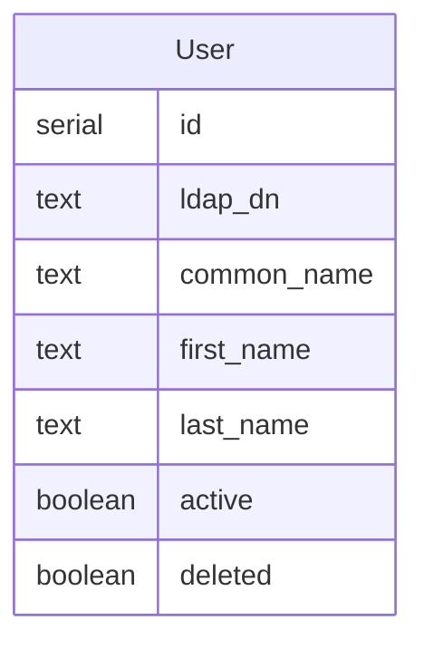

# Diagram relacji w bazie danych

**Czyli inaczej diagram związków encji.**

```mermaid
erDiagram
    User {
        serial  id
        text    ldap_dn
        text    common_name
        text    first_name
        text    last_name
        boolean active
        boolean deleted
    }
```
