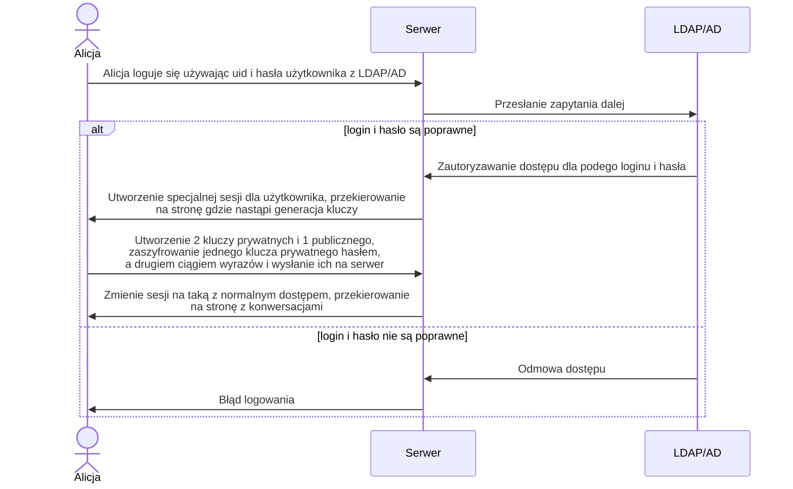

Pierwsze poprawne logowanie

```mermaid
sequenceDiagram
    actor Alicja
    Alicja->>Serwer: Alicja loguje się używając uid i hasła użytkownika z LDAP/AD
    Serwer->>LDAP/AD: Przesłanie zapytania dalej
    alt login i hasło są poprawne
        LDAP/AD->>Serwer: Zautoryzawanie dostępu dla podego loginu i hasła
        Serwer->>Alicja: Utworzenie specjalnej sesji dla użytkownika, przekierowanie<br/>na stronę gdzie nastąpi generacja kluczy
        Alicja->>Serwer: Utworzenie 2 kluczy prywatnych i 1 publicznego,<br/>zaszyfrowanie jednego klucza prywatnego hasłem,<br/>a drugiem ciągiem wyrazów i wysłanie ich na serwer
        Serwer->>Alicja: Zmienie sesji na taką z normalnym dostępem, przekierowanie<br/>na stronę z konwersacjami
    else login i hasło nie są poprawne
        LDAP/AD->>Serwer: Odmowa dostępu
        Serwer->>Alicja: Błąd logowania
    end
```

